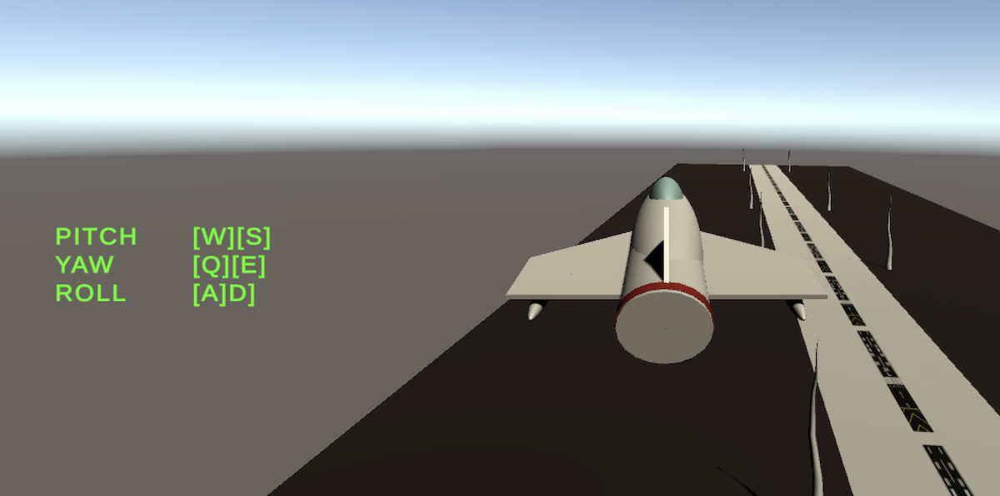

# Description
An example of 3D flight with keyboard in Unity

# Usage
Open Playground scene and run it.

If you want to add flight capablity to an object in your project then
* Create a 3D object and add a RigidBody to it
* In the RigidBody >> Constraints >> Check freeze rotation for x, y and z
* Attach the fly.cs script to the object
* Configure keyboard inputs with Edit >> Project Settings >> Input Manager >> Set Horizontal [A][D] (for yaw), Set Vertical [W][S] (for pitch), Define "Roll" [Q][D]
